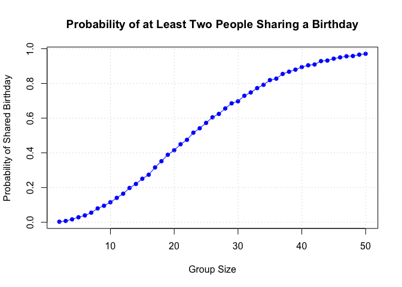
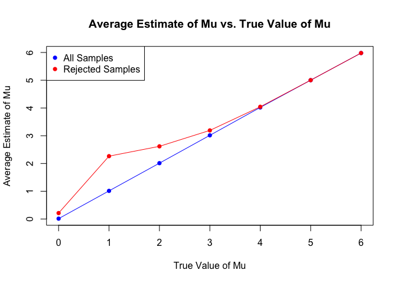
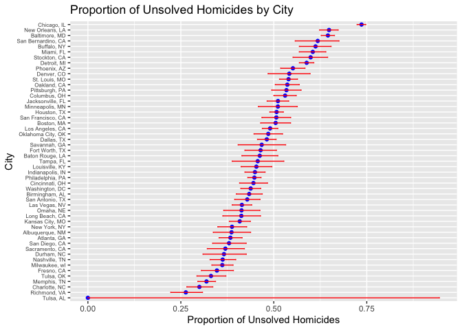

p8105_hw5_zz3308
================
Zitao Zhang
2024-11-14

# Problem 1

``` r
share_birthday <- function(group_size) {
  birthday <- sample(1:365, group_size, replace = TRUE)
  return(length(birthday) != length(unique(birthday)))
}

group_sizes <- 2:50
num_times <- 10000
probabilities <- numeric(length(group_sizes))

for (i in 1:49) {
  group_size <- group_sizes[i]
  shared_birthday_count <- sum(replicate(num_times, share_birthday(group_size)))
  probabilities[i] <- shared_birthday_count / num_times
}

plot(group_sizes, probabilities, type = "o", pch = 16, col = "blue",
     xlab = "Group Size", ylab = "Probability of Shared Birthday",
     main = "Probability of at Least Two People Sharing a Birthday")
grid()
```

<!-- -->

The plot shows that as group size increases, the probability of at least
two people sharing a birthday rises sharply. Around a group size of 23,
this probability reaches about 50%, meaning there’s a 50-50 chance of a
shared birthday, and by a group size of 50, the probability is nearly
certain.

# Problem 2

``` r
n <- 30
sigma <- 5
mus <- c(0, 1, 2, 3, 4, 5, 6)

results <- map_dfr(mus, function(mu) {
  map_dfr(1:5000, function(i) {
    data <- rnorm(n, mean = mu, sd = sigma)
    test <- t.test(data, mu = 0) %>% broom::tidy()
    
    tibble(
      mu = mu,
      estimate = test %>% pull(estimate),
      p_value = test %>% pull(p.value)
    )
  })
})

power_results <- results %>%
  group_by(mu) %>% 
  summarize(power = mean(p_value < 0.05), .groups = 'drop')


plot(power_results %>% pull(mu), power_results %>% pull(power), type = "o", pch = 16, col = "blue",
     xlab = "True Value of Mu", ylab = "Power (Proportion of Rejections)",
     main = "Power vs. True Value of Mu")
```

<!-- -->

The plot shows a positive association between effect size (the true
value of $\mu$) and statistical power (the proportion of rejections of
the null hypothesis). As the effect size increases, the power of the
test also increases. With a small effect size (near $\mu$=0), the power
is low, meaning there’s a low probability of correctly rejecting the
null hypothesis. However, as the effect size grows (moving from
$\mu$=6), the power steadily rises, approaching 1.0, indicating a high
probability of rejecting the null hypothesis when it is indeed false.
This relationship demonstrates that larger effect sizes make it easier
to detect a true effect, resulting in higher power.

``` r
avg_estimates <- results %>%
  group_by(mu) %>%
  summarize(avg_estimates = mean(estimate), .groups = 'drop')

avg_estimates_rejected <- results %>%
  filter(p_value < 0.05) %>%
  group_by(mu) %>%
  summarize(avg_estimates_rejected = mean(estimate), .groups = 'drop')


plot(avg_estimates %>% pull(mu), avg_estimates %>% pull(avg_estimates), type = "o", pch = 16, col = "blue",
     xlab = "True Value of Mu", ylab = "Average Estimate of Mu",
     main = "Average Estimate of Mu vs. True Value of Mu")

points(avg_estimates_rejected %>% pull(mu), avg_estimates_rejected %>% pull(avg_estimates_rejected), type = "o", pch = 16, col = "red")

legend("topleft", legend = c("All Samples", "Rejected Samples"),
       col = c("blue", "red"), pch = 16)
```

<!-- -->

No, the sample average of $\hat\mu$ across tests for which the null
hypothesis is rejected is not approximately equal to the true value of
$\mu$, especially for smaller values of $\mu$. In the plot, we see that
the red line (representing rejected samples) tends to be higher than the
blue line (representing all samples), particularly for small values of
$\mu$.

This discrepancy occurs due to selection bias. When we only consider
samples for which the null hypothesis was rejected (i.e., when the
sample mean $\hat\mu$ is significantly different from 0), we are
inherently selecting cases where $\hat\mu$ deviates from 0 in the
direction of the true effect. This selection causes an upward bias in
the average of $\hat\mu$ among rejected tests. As the true $\mu$
increases, this bias diminishes because the probability of rejecting the
null hypothesis approaches 1, reducing the impact of selective
reporting.

# Problem 3

``` r
url <- "https://github.com/washingtonpost/data-homicides/blob/master/homicide-data.csv?raw=true"
homicide_data <- read.csv(url) %>% janitor::clean_names()
```

The raw data from the Washington Post dataset on homicides in 50 large
U.S. cities contains information about individual homicide cases. Each
row represents a single homicide, and the columns include details about
the case, such as:

City: The city where the homicide occurred.  
State: The state where the homicide occurred.  
Reported data: The year in which the homicide took place.  
Victim’s age: The age of the victim.  
Victim’s sex: The gender of the victim.  
Victim’s race: The race or ethnicity of the victim.  
Dispositon: The current status of the case.

``` r
homicide_summary <- homicide_data %>%
  mutate(city_state = paste(city, state, sep = ", ")) %>%
  group_by(city_state) %>%
  summarize(
    total_homicides = n(),
    unsolved_homicides = sum(disposition %in% c("Closed without arrest", "Open/No arrest"))
  )
```

``` r
baltimore_data <- filter(homicide_summary, city_state == "Baltimore, MD")
baltimore_test <- prop.test(
  baltimore_data %>% pull(unsolved_homicides), 
  baltimore_data %>% pull(total_homicides))

baltimore_result <- broom::tidy(baltimore_test) %>% select(estimate, conf.low, conf.high)
baltimore_result
```

    ## # A tibble: 1 × 3
    ##   estimate conf.low conf.high
    ##      <dbl>    <dbl>     <dbl>
    ## 1    0.646    0.628     0.663

``` r
city_results <- homicide_summary %>%
  mutate(
    prop_test = map2(unsolved_homicides, 
                     total_homicides, 
                     ~ prop.test(.x, .y, correct = TRUE) %>% broom::tidy() %>%
                       select(estimate, conf.low, conf.high))
  ) %>%
  unnest(prop_test)

city_results
```

    ## # A tibble: 51 × 6
    ##    city_state     total_homicides unsolved_homicides estimate conf.low conf.high
    ##    <chr>                    <int>              <int>    <dbl>    <dbl>     <dbl>
    ##  1 Albuquerque, …             378                146    0.386    0.337     0.438
    ##  2 Atlanta, GA                973                373    0.383    0.353     0.415
    ##  3 Baltimore, MD             2827               1825    0.646    0.628     0.663
    ##  4 Baton Rouge, …             424                196    0.462    0.414     0.511
    ##  5 Birmingham, AL             800                347    0.434    0.399     0.469
    ##  6 Boston, MA                 614                310    0.505    0.465     0.545
    ##  7 Buffalo, NY                521                319    0.612    0.569     0.654
    ##  8 Charlotte, NC              687                206    0.300    0.266     0.336
    ##  9 Chicago, IL               5535               4073    0.736    0.724     0.747
    ## 10 Cincinnati, OH             694                309    0.445    0.408     0.483
    ## # ℹ 41 more rows

``` r
ggplot(city_results, aes(x = reorder(city_state, estimate), y = estimate)) +
  geom_point(color = "blue") +
  geom_errorbar(aes(ymin = conf.low, ymax = conf.high), width = 0.2, color = "red") +
  labs(
    title = "Proportion of Unsolved Homicides by City",
    x = "City",
    y = "Proportion of Unsolved Homicides"
  ) +
  coord_flip() +
  theme(axis.text.y = element_text(size = 6))
```

<!-- -->
